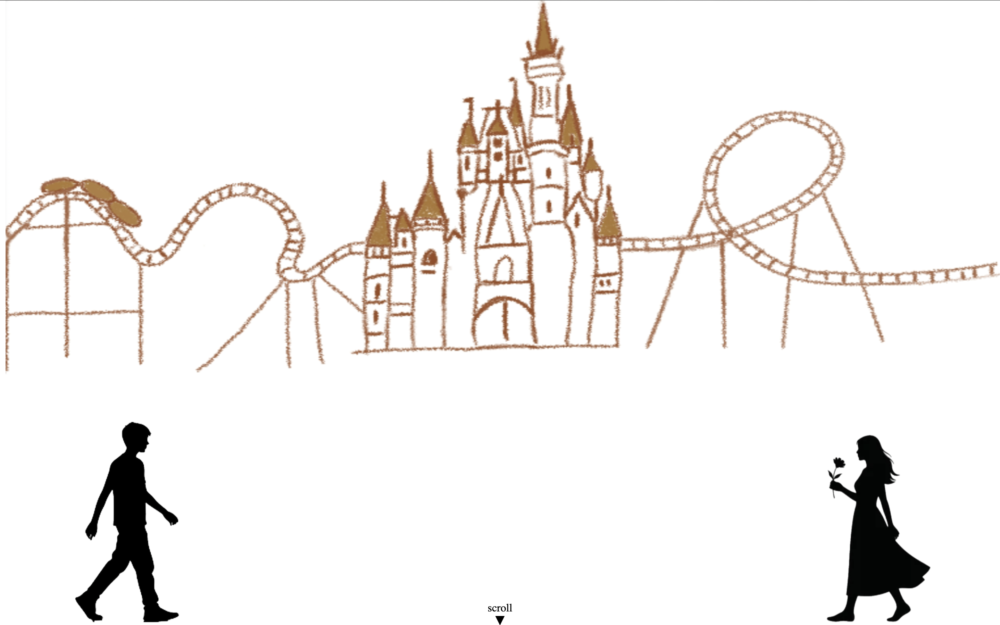
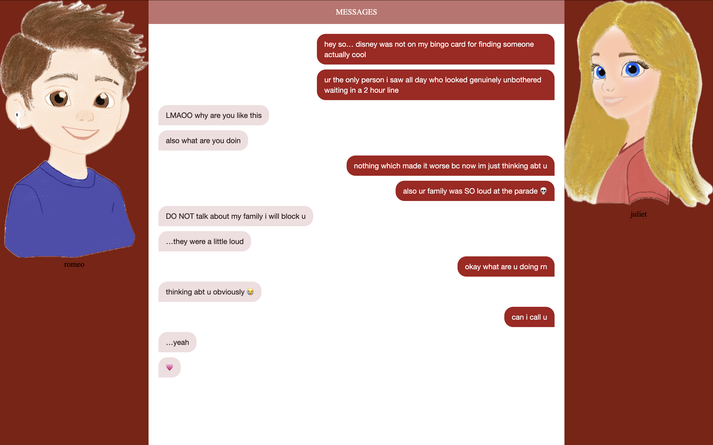
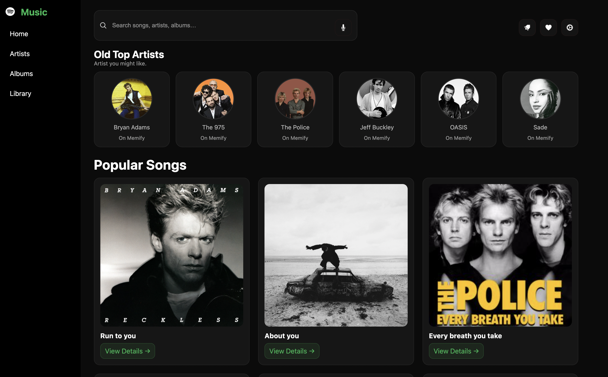
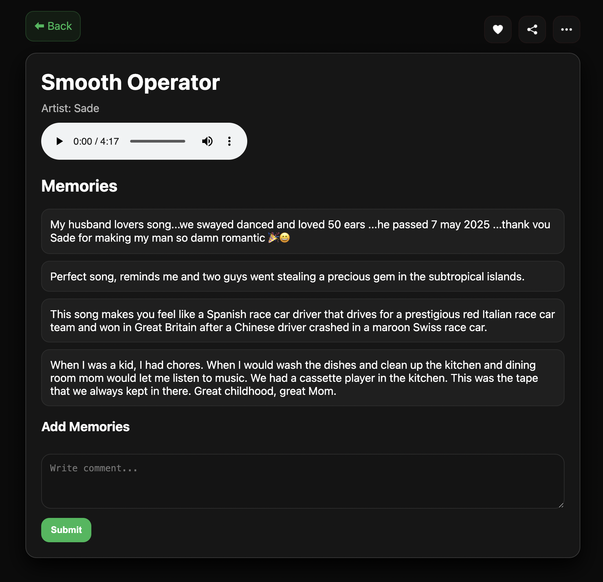

# COM-LAB

THE LIVE LINK TO MY PROJECT IS: [https://paulabombaramirez.github.io/CommLab-S26].

This is Paula's Commlab Page
## FINAL: Romeo & Juliet
A Modern Love Story, Told Through a Screen
A scrollable web adaptation of Shakespeare's Romeo & Juliet, reimagined as a Disney park meet-cute.

DESCRIPTION:
This project adapts Shakespeare's Romeo & Juliet into a modern teenage love story set at a Disney theme park. Rather than retelling the play directly, it translates its emotional core, a sudden connection, stolen moments, and their families pulling them apart . The language of the web: iMessage bubbles, a phone call that cuts off, and a background that slowly turns to night as the story deepens.  The reader does not just read about the story, they scroll through it, wait for messages to appear, and experience the pacing of a conversation they cannot rush.

## MIDTERM: Memify
Songs:
- Run to you by Bryan Adams
- About you by 1975
- Every breath you take by The Police
- Lover you should’ve come over by Jeff Buckley
- Don’t look back on Anger by OASIS
- Smooth Operator by Sade

DESCRIPTION:
My project is a shanzhai version of Spotify that focuses on memory instead of music discovery. It recreates Spotify’s layout but shifts the emphasis to comments and personal experiences connected to songs.

This project explores how music functions as a trigger for memory and emotional experience. While platforms like Spotify are designed for discovering new songs and artists, this reinterpretation shifts the focus toward nostalgia and reflection. By recreating Spotify’s familiar structure, the project invites users into a space that feels recognizable, but introduces a different purpose: engaging with the personal stories connected to music. Each song becomes a point of entry into shared and individual memories, highlighted through comments that take priority over the audio itself. The design emphasizes how digital platforms can shape not only what we listen to, but how we remember. Through this shift, the project transforms a music streaming interface into a space for emotional recall and collective memory.

- Journey through spreadheets
- tutorial scroll
- [life scroll](life-scroll)

## journey through spreadsheets insight 

## life scroll insight 

## tutorial website insight

